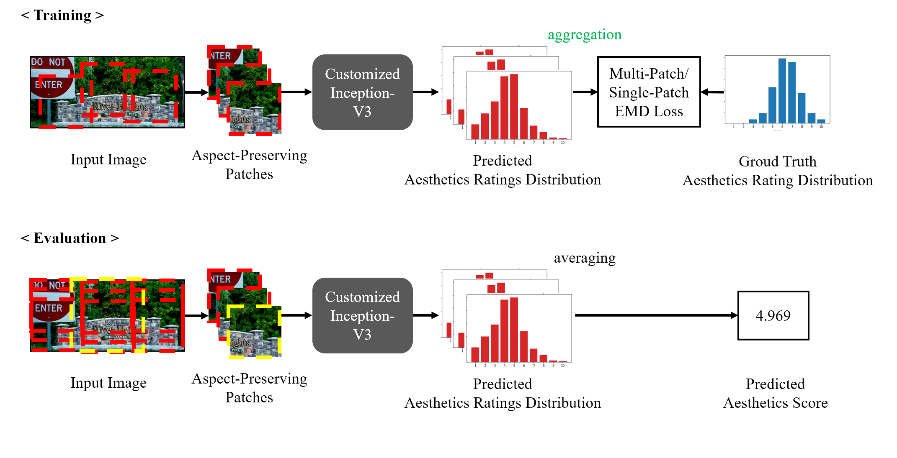

# Image Aesthetics Prediction Using Multiple Patches Preserving the Original Aspect Ratio of Contents


## Introduction
**MPA-Net** is a model for aesthetics quality assessment (AQA). One of the advantage of this model is that the aspect ratios of images are preserved during both training and evaluation. Since this model is end-to-end and straightforward, wide applications are expected. 




## Installation
### Requirements

Our code is designed to run at **python 3.5.2**. We did not test for lower or upper versions. (Upper versions are usually no problem.)

### Installation of Pip Libraries
```
$ pip install -r requirements.txt
```

### Preparation of Datasets.
* The images of AVA dataset (Murray et al., 2012) is required. To download the dataset, maybe [this repository](https://github.com/mtobeiyf/ava_downloader) is helpful.
* Each image of the dataset should have the file name `<id>.jpg`.

### Trained model
* Trained model for this code is [here](https://drive.google.com/file/d/1j9IZ9gQadxg-_KE0uZLB94OubqEqYEBC/view?usp=sharing)


## Usage
### Evaluation

General usage is as follows:

```
python3 main_Ind_EMD.py --path-to-train-csv <(dummy_path)> --path-to-test-csv <eval_iamge_ids>.csv --path-to-images <image_dir> --num-workers 16 -b 64 --val-batch-size 10 --resultdir <result_dir> --gpu --crop-num <(dummy_value)> --beta 0.4 --pr_weight 1.2 --dataset-seed 10 --evaluate --resume <model_path> --evaluate-stem <result_name> --local-global-crop-nums 3
```

Note: You have to specify some `<(dummy_path)>` for several arguments for now.


e.g.)

```
python3 main_Ind_EMD.py --path-to-train-csv dataset/ava/test.csv --path-to-test-csv dataset/ava/test.csv --path-to-images <your_image_dir> --num-workers 16 -b 64 --val-batch-size 10 --resultdir result_eval/ --gpu --crop-num 8 --beta 0.4 --pr_weight 1.2 --dataset-seed 10 --evaluate --resume <your_model_path> --evaluate-stem eval_sample --local-global-crop-nums 3
```


### Train
General usage is as follows:

```
python3 main_Ind_EMD.py --path-to-train-csv <train_image_ids>.csv --path-to-test-csv <val_iamge_ids>.csv --path-to-images <image_dir> --num-workers 16 -b 64 --val-batch-size 10 --epochs 200 --conv-lr 1e-2 --dense-lr 1e-2 --resultdir <result_dir> --momentum 0.9 --save-freq 5 --gpu --crop-num 8 --beta 0.4 --pr_weight 1.2 --dataset-seed 10 --lr-decay-rate 0.9 --lr-decay-freq 10 --nima-pretrained true --path-to-nima <pretrained_NIMA_path>
```

In training, we recommend to use pretrained NIMA (`<pretrained_NIMA_path>` above) for finetuning. The sample pretrained NIMA model is [here](https://drive.google.com/file/d/1dUEvuTSPbOgT13iTWe27ZerY2EfT4Ok5/view?usp=sharing).


e.g.)
```
python3 main_Ind_EMD.py --path-to-train-csv dataset/ava/train.csv --path-to-test-csv dataset/ava/val.csv --path-to-images <your_image_dir> --num-workers 16 -b 64 --val-batch-size 10 --epochs 200 --conv-lr 1e-2 --dense-lr 1e-2 --resultdir result_train/ --momentum 0.9 --save-freq 5 --gpu --crop-num 8 --beta 0.4 --pr_weight 1.2 --dataset-seed 10 --lr-decay-rate 0.9 --lr-decay-freq 10 --nima-pretrained true --path-to-nima <your_pretrained_NIMA_path>
```


## Files
### Datasets
Lists of image ids are located at `dataset/`. Each CSV file contains image ids and scores.

### Scripts
* `main_Ind_EMD.py`: The main script for both training and evaluation.
* `net.py`: The file for scripts of model definitions. (Please note that some deprecated classes and funcs are still left. We hope they will be somewhat helpful for your extension.)
* `dataset.py`: The file for scripts of dataset processing. (As well as `net.py`, some deprecated classes and funcs are still left.)


## Citation
If you find this code is useful or use in your work, please cite our paper.

```
@article{wang2020image,
  title={Image Aesthetics Prediction Using Multiple Patches Preserving the Original Aspect Ratio of Contents},
  author={Wang, Lijie and Wang, Xueting and Yamasaki, Toshihiko},
  journal={arXiv preprint arXiv:2007.02268},
  year={2020}
}
```

